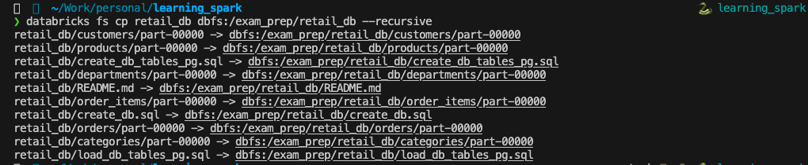

## Here are some commonly used Databricks CLI commands:

* databricks fs ls
* databricks fs mkdirs dbfs:/exam_prep
* databricks fs cp retail_db dbfs:/exam_prep/retail_db --recursive

* databricks fs cp retail_db_json dbfs:/exam_prep/retail_db_json --recursive
    * https://github.com/itversity/retail_db_json.git